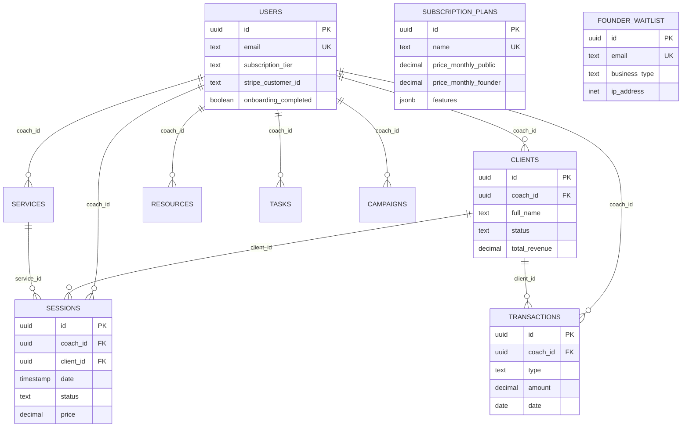
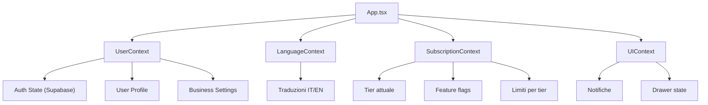

# ⚙️ 08 — Tech Architecture

> **Responsabile**: Tech Lead  
> **Ultimo aggiornamento**: 17 Giugno 2026  
> **Status**: ✅ Architettura solida — Documentata

---

## 🏗️ Stack Tecnologico

| Layer | Tecnologia | Versione | Ruolo |
|-------|-----------|----------|-------|
| **Frontend** | React | 19.x | UI Framework |
| **Language** | TypeScript | 5.x | Type safety |
| **Build** | Vite | 6.x | Dev server + bundler |
| **Styling** | Tailwind CSS | 4.x | Utility-first CSS |
| **Animations** | Framer Motion | — | Page transitions, micro-animations |
| **Icons** | Lucide React | — | Icon system |
| **Charts** | Recharts | — | Dashboard KPI charts |
| **PDF** | jsPDF | — | Invoice/report export |
| **Backend** | Supabase | — | PostgreSQL + Auth + Storage + Edge Functions |
| **Payments** | Stripe | — | Checkout + Subscriptions |
| **AI** | Google Gemini | — | AI Coach business insights |
| **Routing** | React Router DOM | — | SPA routing (BrowserRouter) |
| **State** | React Context | — | Global state (User, Language, Subscription, UI) |

---

## 📁 Struttura Progetto

```
c:\luminel manager\
├── App.tsx                     # Router principale + ProtectedRoute + AdminRoute
├── main.tsx                    # Entry point React
├── types.ts                    # Tipi TypeScript globali
├── config.ts                   # APP_CONFIG (nome, valuta, timezone, temi)
├── index.css                   # Tailwind + custom CSS + design tokens
│
├── components/
│   ├── HomeLanding.tsx         # Landing page pubblica (StoryBrand) — 55KB
│   ├── FounderLanding.tsx      # Sales page Founder — 72KB
│   ├── Login.tsx               # Auth (login/register/forgot) — 11KB
│   ├── Dashboard.tsx           # Dashboard KPI — 28KB
│   ├── Clients.tsx             # CRM completo — 113KB
│   ├── Calendar.tsx            # Calendario sessioni — 46KB
│   ├── Finance.tsx             # Gestione finanziaria — 54KB
│   ├── Analytics.tsx           # Analytics avanzate — 27KB
│   ├── Team.tsx                # Team management — 27KB
│   ├── Programs.tsx            # Servizi/Programmi — 20KB
│   ├── Library.tsx             # Libreria risorse — 27KB
│   ├── Settings.tsx            # Impostazioni aziendali — 30KB
│   ├── AdminDashboard.tsx      # GOD Mode admin — 29KB
│   ├── Layout.tsx              # Sidebar + Header + Profile modal — 20KB
│   ├── AIAssistant.tsx         # Chatbot Gemini AI — 8KB
│   ├── Logo.tsx                # Componente logo dinamico
│   ├── SplashIntro.tsx         # Splash screen con quote animate
│   ├── NotificationDrawer.tsx  # Drawer notifiche
│   ├── PaymentSuccess.tsx      # Conferma pagamento Stripe
│   ├── FoundingMemberBadge.tsx # Badge Founding Member + Tier
│   ├── ResetPasswordPage.tsx   # Reset password form
│   └── LegalModals.tsx         # Privacy, Terms, Cookie modals
│
├── contexts/
│   ├── UserContext.tsx          # Auth state, profile, business settings
│   ├── LanguageContext.tsx      # i18n (IT/EN)
│   ├── SubscriptionContext.tsx  # Feature gating, tier, limits
│   └── UIContext.tsx            # UI state (notifications, drawers)
│
├── services/
│   ├── supabaseClient.ts       # Supabase init + DB types
│   ├── clientService.ts        # CRUD clienti
│   ├── sessionService.ts       # CRUD sessioni
│   ├── financeService.ts       # CRUD transazioni
│   ├── programService.ts       # CRUD servizi/programmi
│   ├── resourceService.ts      # CRUD risorse
│   ├── teamService.ts          # CRUD team members
│   ├── taskService.ts          # CRUD tasks
│   ├── settingsService.ts      # Settings CRUD + Supabase sync
│   ├── storageService.ts       # File upload (Supabase Storage)
│   ├── notificationService.ts  # Notifiche
│   ├── analyticsService.ts     # Calcoli analytics
│   ├── waitlistService.ts      # Waitlist Founder (Supabase RPC)
│   ├── stripeService.ts        # Redirect to Stripe Checkout
│   ├── stripePrices.ts         # Price IDs + Payment Links
│   ├── tierLimits.ts           # Feature gating per tier
│   ├── geminiService.ts        # Gemini AI integration
│   └── pdfService.ts           # PDF generation (jsPDF)
│
├── database/
│   ├── schema.sql              # Schema completo (8 tabelle + RLS)
│   └── migration_v2.0_subscriptions.sql # Subscription system + waitlist
│
├── control/                    # 📂 QUESTA CARTELLA — Command Center
│   ├── 00_INDICE.md
│   ├── 01_BRAND_IDENTITY.md
│   ├── ...
│
└── package.json                # Dependencies + scripts
```

---

## 🗄️ Database Schema



---

## 🌐 Context System



---

## 🔑 Variabili d'Ambiente

```env
# .env.local (NON committare!)
VITE_SUPABASE_URL=https://your-project.supabase.co
VITE_SUPABASE_ANON_KEY=eyJ...
VITE_GEMINI_API_KEY=AI...
VITE_META_PIXEL_ID=123456789
```

---

## 🚀 Comandi Dev

```bash
# Sviluppo
npm run dev          # Vite dev server (localhost:5173)

# Build produzione
npm run build        # Output in /dist

# Preview build
npm run preview      # Serve la build localmente

# Linting
npm run lint         # ESLint check
```

---

## 📊 Metriche Codice

| Metrica | Valore |
|---------|--------|
| Componenti totali | ~25 |
| Services | 18 |
| Contexts | 4 |
| File più grande | `Clients.tsx` (113KB) |
| Tabelle DB | 10 |
| RLS Policies | 10+ |
| Lingue supportate | IT, EN |
