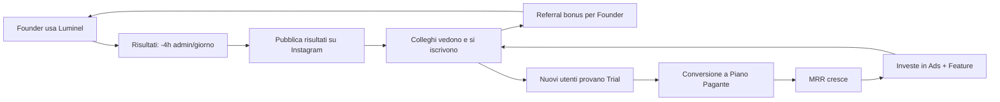

# 🚀 09 — Growth Roadmap

> **Responsabile**: Growth Hacker + Product Manager  
> **Ultimo aggiornamento**: 17 Giugno 2026  
> **Status**: ✅ Roadmap definita — Da rivedere ogni mese

---

## 🎯 Obiettivo Finale

> **€1.000.000 ARR** (€83.333 MRR) entro **Dicembre 2028**

---

## 📅 Fase 1: PRE-LANCIO (Giugno-Luglio 2026)

### Obiettivo: Lancio Pronto + 25 Founder Chiusi

| # | Task | Priorità | Stato |
|---|------|----------|-------|
| 1 | Fixare incoerenze prezzi (un'unica fonte di verità) | 🔴 | ⬜ TODO |
| 2 | Passare Stripe da TEST a LIVE | 🔴 | ⬜ TODO |
| 3 | Creare Webhook Stripe (Edge Function) | 🔴 | ⬜ TODO |
| 4 | Inserire numero WhatsApp Business reale | 🔴 | ⬜ TODO |
| 5 | Fixare countdown con data reale (non hardcoded) | 🟡 | ⬜ TODO |
| 6 | Allineare HomeLanding spots con Supabase | 🟡 | ⬜ TODO |
| 7 | Spostare admin check in Supabase | 🟡 | ⬜ TODO |
| 8 | Aggiungere CAPTCHA al form waitlist | 🟡 | ⬜ TODO |
| 9 | Cookie consent banner (GDPR) | 🟡 | ⬜ TODO |
| 10 | Testing completo: Auth, Payments, RLS | 🔴 | ⬜ TODO |
| 11 | Deploy su dominio definitivo (luminel.app?) | 🔴 | ⬜ TODO |
| 12 | Email automatiche (Resend): welcome, reminder | 🟡 | ⬜ TODO |
| 13 | Popolare waitlist con contatti warm (LinkedIn, Instagram DM) | 🟡 | ⬜ TODO |
| 14 | Copyright anno: "© 2025" → "© 2026" | 🟢 | ⬜ TODO |

### Milestone: **25 Founding Members paganti**
- Revenue atteso: ~€1.750/m MRR iniziale

---

## 📅 Fase 2: LANCIO PUBBLICO (Agosto-Dicembre 2026)

### Obiettivo: 200 Utenti Paganti, €15K MRR

| # | Feature/Task | Priorità |
|---|-------------|----------|
| 1 | Trial 14 giorni (senza carta) | 🔴 |
| 2 | Onboarding wizard interattivo (primo accesso) | 🔴 |
| 3 | Email marketing automation (drip campaign) | 🔴 |
| 4 | Referral program ("Invita un collega, ottieni 1 mese gratis") | 🟡 |
| 5 | Blog/SEO: 20 articoli chiave ("gestionale parrucchiere", "software estetista") | 🟡 |
| 6 | Instagram Ads: lookalike audience dai Founder | 🟡 |
| 7 | Google Ads: keyword "gestionale [settore]" | 🟡 |
| 8 | Partnership con scuole di estetica/parrucchiere | 🟢 |
| 9 | Mobile app (React Native o PWA) | 🟡 |
| 10 | WhatsApp Business API (messaggi automatici conferma sessione) | 🟡 |
| 11 | Google Calendar 2-way sync reale | 🟡 |
| 12 | Inventory management (prodotti in vendita) | 🟢 |

### Milestone: **200 utenti paganti, €15K MRR**

---

## 📅 Fase 3: SCALA (Gennaio-Giugno 2027)

### Obiettivo: 800 Utenti, €60K MRR

| # | Feature/Task | Priorità |
|---|-------------|----------|
| 1 | Multi-location (catene di saloni) | 🔴 |
| 2 | API pubblica documentata (per integratori) | 🟡 |
| 3 | Marketplace template (programmi condivisibili) | 🟡 |
| 4 | Booking page pubblica per i clienti finali | 🔴 |
| 5 | SMS reminders (Twilio) | 🟡 |
| 6 | Zapier / Make.com integration ufficiale | 🟡 |
| 7 | Dashboard analytics per admin (MRR reale, churn, LTV) | 🔴 |
| 8 | Internazionalizzazione: Spagna, Francia | 🟡 |
| 9 | Customer success team (1 persona) | 🟡 |
| 10 | Luminel Academy (corsi business per professionisti) | 🟢 |

### Milestone: **800 utenti, €60K MRR**

---

## 📅 Fase 4: EMPIRE (Luglio 2027 - Dicembre 2028)

### Obiettivo: €1M ARR 🎯

| # | Feature/Task |
|---|-------------|
| 1 | AI avanzata: previsioni revenue, suggerimenti pricing, churn prediction |
| 2 | White-label completo: clienti con il LORO brand |
| 3 | Franchise management: multi-brand, multi-location |
| 4 | Marketplace integrazioni: addon community |
| 5 | Mobile app nativa (iOS + Android) |
| 6 | Team: 3-5 persone (dev, support, sales) |
| 7 | Sede legale / SRL dedicata |
| 8 | Series A preparation (se desiderato) |

### Milestone: **€1M ARR** = ~1.200 utenti a €70/m avg 🏆

---

## 📊 Growth Flywheel

---

## 📈 Revenue Milestones

| Milestone | Utenti | MRR | ARR | Timeline |
|-----------|--------|-----|-----|----------|
| 🌱 Seed | 25 | €1.750 | €21K | Luglio 2026 |
| 🌿 Traction | 100 | €8K | €96K | Ottobre 2026 |
| 🌳 Growth | 200 | €16K | €192K | Dicembre 2026 |
| 🏔️ Scale | 500 | €40K | €480K | Giugno 2027 |
| 🏛️ Empire | 800 | €65K | €780K | Dicembre 2027 |
| 👑 **€1M** | **1.200** | **€84K** | **€1.008K** | **Dicembre 2028** |

---

## 🔑 Leve di Crescita Principali

### 1. Referral (Costo €0)
- Ogni Founder invita 2-3 colleghi → crescita esponenziale
- Incentivo: 1 mese gratis per ogni referral che paga

### 2. SEO (Costo Tempo)
- Target keyword: "gestionale parrucchiere", "software estetista", "crm coach"
- 20 articoli long-form → 2.000 visite/mese organiche entro 6 mesi

### 3. Instagram Ads (Budget €500-2000/m)
- Lookalike dai Founder (hanno il profilo perfetto)
- Video ad: "Come gestisco 180 clienti in 19 minuti al giorno"
- Target: professionisti benessere Italia, 25-45 anni

### 4. Partnership (Costo €0)
- Scuole di estetica/parrucchiere → Luminel come "strumento didattico"
- Associazioni di categoria → Luminel come "partner tecnologico"
- Distributori prodotti beauty → cross-sell
