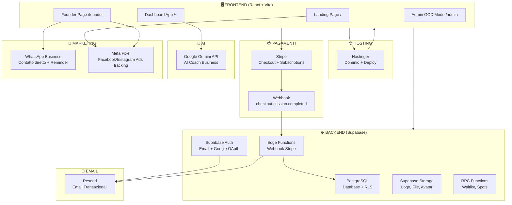

# 🌐 11 — Mappa Ecosistema Luminel

> **Ultimo aggiornamento**: 17 Giugno 2026  
> **Status**: Mappa definitiva — Aggiornare ad ogni nuovo servizio

---

## 🏗️ Architettura Completa



---

## 📋 Tutti i Servizi — Uno per Uno

### 1. 🌐 Hostinger — Hosting + Dominio
| Cosa | Dettaglio |
|------|-----------|
| **Ruolo** | Hosting del frontend (build Vite statica) + dominio |
| **Cosa hosta** | I file `/dist` generati da `npm run build` |
| **Dominio** | Da configurare (es. `luminel.app` o `luminel.it`) |
| **Costo** | ~€3-10/mese |
| **Stato** | ⬜ Da configurare per produzione |

---

### 2. ⚙️ Supabase — Backend Completo
| Cosa | Dettaglio |
|------|-----------|
| **Database** | PostgreSQL con 10 tabelle + RLS su tutte |
| **Auth** | Email/Password + Google OAuth + Reset password |
| **Storage** | Upload logo, avatar, file risorse |
| **Edge Functions** | Per webhook Stripe (da creare) |
| **RPC Functions** | `join_founder_waitlist()`, `get_founder_spots_remaining()` |
| **Costo** | Free tier (fino a 500MB DB, 50K auth users) poi ~€25/mese |
| **Stato** | ✅ Configurato e funzionante |

---

### 3. 💳 Stripe — Pagamenti
| Cosa | Dettaglio |
|------|-----------|
| **Ruolo** | Checkout per abbonamenti (Payment Links) |
| **Prodotti** | 4 piani × 2 cicli = 8 Payment Links |
| **Flusso** | Frontend → Stripe Checkout → Webhook → Supabase → Attivazione |
| **Costo** | 1.4% + €0.25 per transazione (EU) |
| **Stato** | ⚠️ TEST MODE — Da passare a LIVE |

---

### 4. 🤖 Google Gemini — AI Coach
| Cosa | Dettaglio |
|------|-----------|
| **Ruolo** | Chatbot AI con contesto business dell'utente |
| **Modello** | Gemini (via `geminiService.ts`) |
| **Input** | Query utente + context JSON (revenue, clienti, sessioni) |
| **Costo** | Free tier generoso, poi pay-per-use (~$0.001/query) |
| **Stato** | ✅ Funzionante ma con dati mock (da collegare a dati reali) |

---

### 5. 📧 Resend — Email Transazionali
| Cosa | Dettaglio |
|------|-----------|
| **Ruolo** | Invio email: verifica account, reset password, welcome, reminder |
| **Integrazione** | Supabase Auth SMTP → Resend |
| **Email da configurare** | Welcome Founder, Verifica email, Reset password, Reminder sessione |
| **Costo** | Free fino a 3.000 email/mese, poi ~€20/mese |
| **Stato** | ⚠️ Parziale — Auth emails funzionano, transazionali da creare |

---

### 6. 📱 WhatsApp Business — Comunicazione Diretta
| Cosa | Dettaglio |
|------|-----------|
| **Ruolo** | Contatto diretto Founder ↔ Michael + Reminder clienti |
| **Fase 1** | Link `wa.me/39XXXXXXXXXX` per contatto diretto (FloatingContact) |
| **Fase 2** | WhatsApp Business API per messaggi automatici (conferma sessione, reminder) |
| **Costo** | Fase 1: €0 / Fase 2: ~€50/mese (360dialog o Twilio) |
| **Stato** | ⚠️ Placeholder — Numero non inserito |

---

### 7. 📊 Meta Pixel — Tracking Ads
| Cosa | Dettaglio |
|------|-----------|
| **Ruolo** | Traccia conversioni da Facebook/Instagram Ads |
| **Eventi** | `PageView` (landing), `Lead` (waitlist signup) |
| **Dove** | Installato in `FounderLanding.tsx` |
| **Costo** | €0 (il pixel è gratuito, paghi solo gli ads) |
| **Stato** | ✅ Codice presente, ma Pixel ID da verificare |

---

## 🔄 Flussi Principali

### Flusso 1: Founder Signup
```
Instagram Ad → Meta Pixel traccia → Landing (/) → Founder Page (/founder)
→ Form Waitlist → Supabase RPC → Email Resend "Sei in lista"
→ Stripe Checkout → Webhook → DB attivato → Email "Benvenuto"
→ Login → Dashboard con tier attivato
```

### Flusso 2: Uso Quotidiano
```
Login → Supabase Auth (JWT) → Dashboard
→ CRM (Supabase DB + RLS) → Calendar → Finance
→ AI Coach (Gemini API con contesto) → Task Manager
→ Logout
```

### Flusso 3: Contatto Diretto
```
Founder Page → FloatingContact → WhatsApp / Google Calendar
→ Conversazione con Michael → Conversione
```

---

## 💰 Costi Mensili Stimati

| Servizio | Free Tier | Dopo Scale (500+ utenti) |
|----------|-----------|--------------------------|
| Hostinger | €3/mese | €10/mese |
| Supabase | €0 | €25/mese |
| Stripe | 1.4% + €0.25/txn | ~€200/mese (su €15K MRR) |
| Gemini API | €0 | ~€5/mese |
| Resend | €0 | €20/mese |
| WhatsApp API | €0 (manuale) | €50/mese |
| Meta Pixel | €0 | €0 |
| **TOTALE** | **~€3/mese** | **~€310/mese** |

> **Margine**: Con €15K MRR e €310 di costi infrastruttura = **98% margine lordo** 🔥

---

## ❓ Servizi che Potresti Aggiungere in Futuro

| Servizio | Quando | Perché |
|----------|--------|--------|
| **Cloudflare** | Pre-lancio | CDN + protezione DDoS + Turnstile CAPTCHA (gratuito) |
| **Twilio** | Fase 2 | SMS reminder appuntamenti |
| **Google Calendar API** | Fase 2 | Sync bidirezionale reale |
| **Make.com / Zapier** | Fase 2 | Automazioni no-code per i clienti |
| **Sentry** | Fase 2 | Error monitoring in produzione |
| **PostHog / Mixpanel** | Fase 2 | Product analytics (quale feature usano di più) |
| **Vercel** | Alternativa | Se Hostinger non basta (SSR, Edge) |
